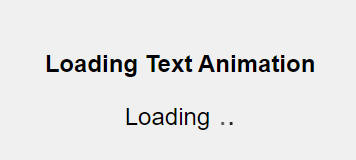

# Simple Loading Text Animation




This project demonstrates a simple page loading bar animation using CSS only. It includes a centered block with a loading text and a title.

## Features

- **Title:** Displayed at the top of the page.
- **Loading Animation:** A loading animation in the center of the page.
- **Responsive Design:** Centered content adjusts based on screen size.

## How to Use

1. Clone the repository: `https://github.com/coderooz/Simple-Loading-Text-Animation`
2. Open `index.html` in a web browser.


### Project Structure

```
project-folder/
│
├── index.html
├── style.css
└── README.md
```

### Code in the project
### index.html

```html
<!DOCTYPE html>
<html lang="en">
<head>
  <meta charset="UTF-8">
  <meta name="viewport" content="width=device-width, initial-scale=1.0">
  <title>Loading Text Animation Example</title>
  <link rel="stylesheet" href="style.css">
</head>
<body>
  <div class="container">
    <h1>Loading Text Animation</h1>
    <div class="loader-text">Loading<span>.</span><span>.</span><span>.</span></div>

  </div>
</body>
</html>

```

### style.css

```css
/* Reset some default styles */
* {
margin: 0;
padding: 0;
box-sizing: border-box;
}

/* Center the content vertically and horizontally */
html, body {
height: 100%;
display: flex;
justify-content: center;
align-items: center;
background-color: #f0f0f0;
}

.container {
text-align: center;
}

h1 {
font-family: Arial, sans-serif;
font-size: 24px;
margin-bottom: 20px;
}

.loader-text {
    font-family: Arial, sans-serif;
    font-size: 24px;
    text-align: center;
    margin: 20px auto;
  }
  
  .loader-text span {
    opacity: 0;
    animation: pulse-text 1.5s infinite;
    font-size: 30px;
  }
  
  .loader-text span:nth-child(2) {
    animation-delay: 0.5s;
  }
  
  .loader-text span:nth-child(3) {
    animation-delay: 1s;
  }
  
  @keyframes pulse-text {
    0% { opacity: 0; }
    50% { opacity: 1; }
    100% { opacity: 0; }
  }
  
``` 

## Credits

- CSS Loading animation inspired by various online examples.
- Designed and implemented by Coderooz [Ranit Saha].

## License

This project is licensed under the MIT License - see the LICENSE file for details.
